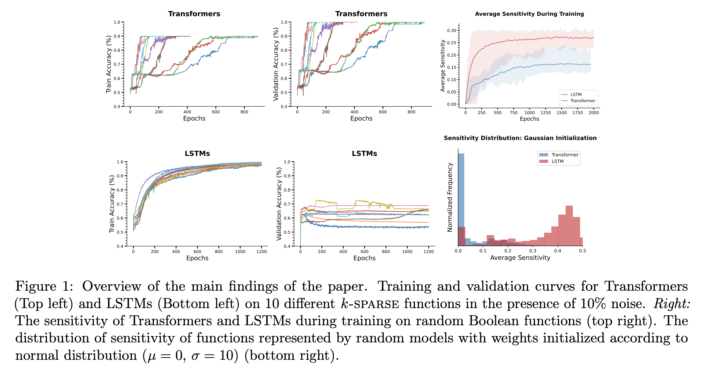

<h2 align="center">
  Simplicity Bias in Transformers
</h2>
<h5 align="center">Simplicity Bias in Transformers and their Ability to Learn Sparse Boolean Functions</h5>

<p align="center">
  <a href="https://2023.aclweb.org/"></a>
  <a href="https://arxiv.org/abs/2211.12316"></a>
  <a href="https://github.com/satwik77/Transformer-Simplicity/blob/main/LICENSE">
    
  </a>
</p>

<p style="text-align: justify;">
Despite the widespread success of Transformers on NLP tasks, recent works have found that they struggle to model several formal languages when compared to recurrent models. This raises the question of why Transformers perform well in practice and whether they have any properties that enable them to generalize better than recurrent models. In this work, we conduct an extensive empirical study on Boolean functions to demonstrate the following: (i) Random Transformers are relatively more biased towards functions of low sensitivity. (ii) When trained on Boolean functions, both Transformers and LSTMs prioritize learning functions of low sensitivity, with Transformers ultimately converging to functions of lower sensitivity. (iii) On sparse Boolean functions which have low sensitivity, we find that Transformers generalize near perfectly even in the presence of noisy labels whereas LSTMs overfit and achieve poor generalization accuracy. Overall, our results provide strong quantifiable evidence that suggests differences in the inductive biases of Transformers and recurrent models which may help explain Transformer's effective generalization performance despite relatively limited expressiveness.
</p>
<h2 align="center">
  
</h2>


#### Dependencies

- compatible with python 3
- dependencies can be installed using `Transformer-Simplicity/requirements.txt`

#### Setup

Install VirtualEnv using the following (optional):

```shell
$ [sudo] pip install virtualenv
```

Create and activate your virtual environment (optional):

```shell
$ virtualenv -p python3 venv
$ source venv/bin/activate
```

Install all the required packages:

at `Transformer-Simplicity/:`

```shell
$ pip install -r requirements.txt
```

#### Models

The current repository includes 4 directories implementing different models and settings:

- Training Transformer on Boolean functions : `Transformer-Simplicity/FLTAtt`
- Training LSTMs on Boolean functions : `Transformer-Simplicity/FLTClassifier`
- Experiments with Random Transformer : `Transformer-Simplicity/RandFLTAtt`
- Experiments with Random LSTM : `Transformer-Simplicity/RandFLTClassifier`


  

#### Usage

The set of command line arguments available can be seen in the respective `args.py` file. Here, we illustrate running the experiment for training Transformers on sparse parities. Follow the same methodology for running any experiments with LSTMs.


At `Transformer-Simplicity/FLTAtt:`

```shell
$	python -m src.main -mode train -gpu 0 -dataset sparity40_5k -run_name trafo_sparity_40_5k -depth 4 -lr 0.001
```

To compute sensitivity of randomly initialized Transformers,  
At `Transformer-Simplicity/RandFLTAtt:`

```shell
$	python rand_sensi.py -gpu 0 -sample_size 1000 -len 20 -trials 100
```


#### Citation

If you use our data or code, please cite our work:

```
@article{bhattamishra2022simplicity,
  title={Simplicity bias in transformers and their ability to learn sparse boolean functions},
  author={Bhattamishra, Satwik and Patel, Arkil and Kanade, Varun and Blunsom, Phil},
  journal={arXiv preprint arXiv:2211.12316},
  year={2022}
}
```

For any clarification, comments, or suggestions please contact [Satwik](https://satwikb.com/) or [Arkil](http://arkilpatel.github.io/).
